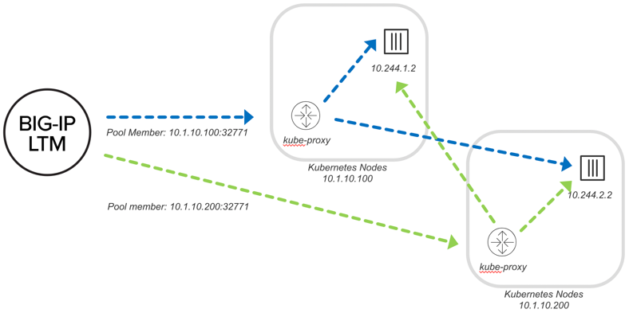
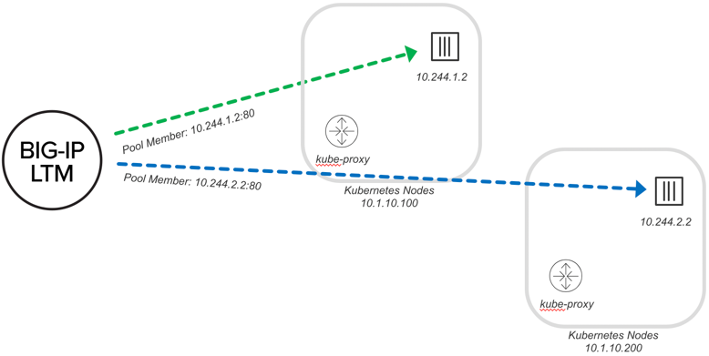
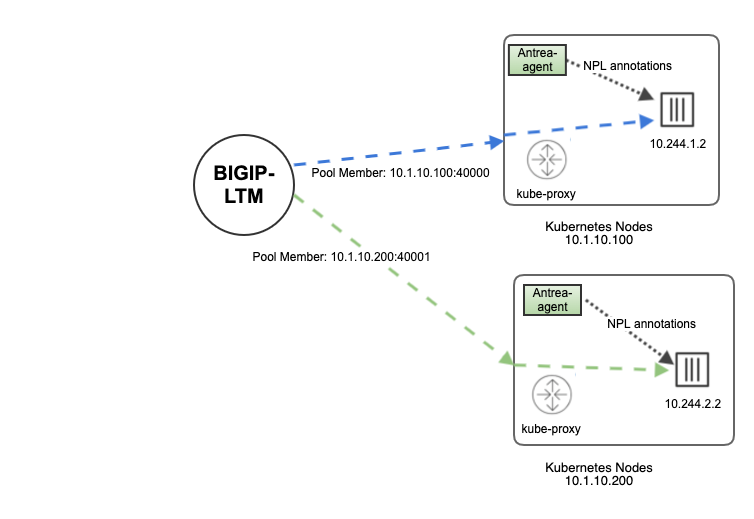

> **** Note: This repo is not maintained nor supported by F5****

# f5 Container Ingress Services (CIS) installation using vanila kubernetes

- [Description](#Description)
- [Deployment Options](#Deployment Options)
- [NodePort](#NodePort)
- [ClusterIP](#ClusterIP)
- [NodePortLocal](#NodePortLocal)

 
## Description
F5 Container Ingress Services (CIS) integrates with container orchestration environments to dynamically create L4/L7 services on F5 BIG-IP systems, and load balance network traffic across the services. Monitoring the orchestration API server, CIS is able to modify the BIG-IP system configuration based on changes made to containerized applications.
F5 Container Ingress Services (CIS) can be configured in multiple ways depending on the customer scenario. CIS can be deployed on Kubernetes and OpenShift platform. CIS installation may differ based on the resources (for example: ConfigMap, Ingress, Routes, and CRD) used by the customer to expose the Kubernetes services. CIS installation also depends on BIG-IP deployment (stand alone and HAproxy configuration) and Kubernetes cluster networking (Flannel/Calico).

The F5 BIG-IP Controller for Kubernetes lets you manage your F5 BIG-IP device from Kubernetes or OpenShift using either environment’s native CLI/API.

Use the following links, the navigation on the left, and/or the Next and Previous buttons to explore the documentation.

## Deployment Options

These options are configured using pool-member-type parameter in CIS deployment.

## 1) NodePort

This section documents K8S with integration of CIS and BIG-IP using NodePort configuration. Benefits of NodePort are:

It works in any environment (no requirement for SDN)
No persistence/visibility to backend Pod
Can be deployed for “static” workloads (not ideal)
Similar to Docker, BIG-IP communicates with an ephemeral port, but in this case the kube-proxy keeps track of the backend Pod (container). This works well, but the downside is that you have an additional layer of load balancing with the kube-proxy.

When using NodePort, pool members represent the kube-proxy service on the node. BIG-IP needs a local route to the nodes. There is no need for VXLAN tunnels or Calico. BIG-IP can dynamically ARP for the Kube-proxy running on node.

## 2) ClusterIP
This section documents K8S with integration of CIS and BIG-IP using clusterIP configuration. Benefits of clusterIP are:

Requires ability to route to Pod
Flannel VXLAN, OpenShift VXLAN
Alternately Pod routable through network, for example:
Calico BGP
Public Cloud network
The BIG-IP CIS also supports a cluster mode where Ingress traffic bypasses the Kube-proxy and routes traffic directly to the pod. This requires that the BIG-IP have the ability to route to the pod. This could be by using an overlay network that F5 supports (Flannel VXLAN, or OpenShift VXLAN). Leave the kube-proxy intact (no changes to underlying Kubernetes infrastructure).

## 3) NodePortLocal
This section documents K8S with integration of CIS and BIG-IP using the NodePortLocal feature provided by Antrea CNI. Benefits of NodePortLocal are:

CIS consumes NPL port mappings published by the Antrea Agent (as K8s Pod annotations). So unlike NodePort mode, it bypasses the Kube-proxy and routes traffic directly to the pod removing the secondary hop of load balancing carried by kube-proxy.
Exposes the port on node where pod is running. It decreases the port range requirements, unlike NodePort which requires a range of ports to be exposed in all Kubernetes nodes.

In NodePortLocal, rather than using kube-proxy for node to pod routing, there is a single iptables entry per pod which means direct connectivity to each pod.
